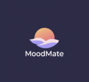
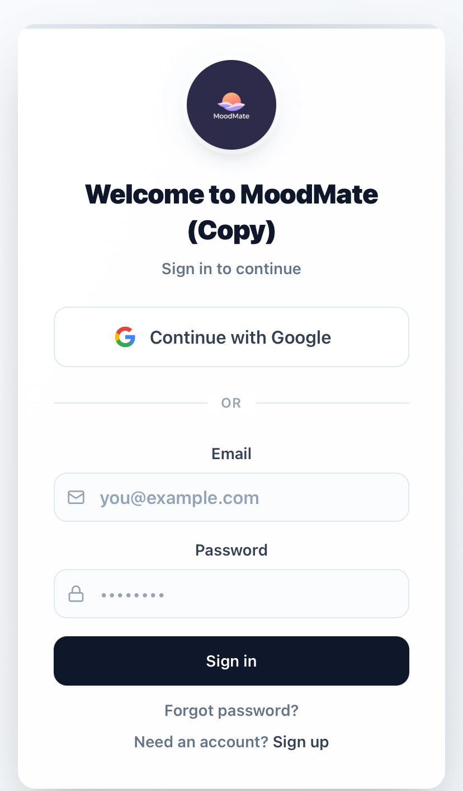
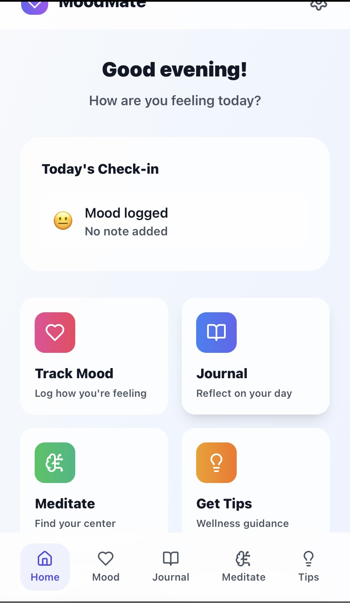

# MoodMate 🧠✨  
**Your AI-powered gateway to mental well-being**  

---

## 🌍 About MoodMate  
MoodMate is not just another app — it’s a **strategic asset**.  
An AI-powered companion for **daily mood tracking, mindful journaling, and stress management**, designed to tap into the **multi-billion mental health market**.  

This project represents **months of development, UX design, and AI integration** — work that can save any buyer **12+ months of dev time and $300k+ in costs**.  

---

## 📸 Exclusive Preview  
Only a few selected screens are shown here.  
The full demo & source code are reserved for **serious buyers only**.  

  
  

---

## 💎 Why MoodMate?  

- **Massive market demand**: Mental health apps are projected to exceed **$17B by 2030**.  
- **High entry barrier**: Developing an MVP of this caliber requires significant time & resources.  
- **AI-first approach**: Positioned at the intersection of **AI + mental health**, a trend exploding globally.  
- **Scalable foundation**: Ready to expand with features like premium subscriptions, therapy integrations, or corporate wellness.  

---

## 💰 Acquisition Terms  

- **Asking Price**: $300,000 (negotiable for the right partner)  
- **Includes**:  
  - Full source code  
  - Exclusive rights to MoodMate  
  - Branding + logo  
  - Roadmap suggestions for scaling  

This is not just a project. It’s a **springboard into one of the fastest-growing markets worldwide**.  

---

## 🔒 Serious Inquiries Only  

To protect the exclusivity of this asset:  

- Full access to the demo and code will be shared **only upon serious acquisition discussions**.  
- Contact via [your email here].  

